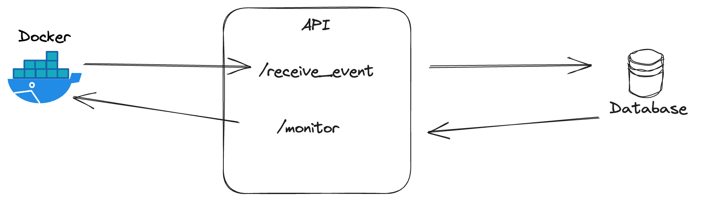

# Data Engineer - Assignment: Data Ingestion

### Description
You're working with a product team that plan to release an improved shopping cart on their e-commerce site.
To ensure that the shopping cart actually makes a difference, the team plan to do an A/B test, where half of the customers get assigned the new shopping cart, while the rest keep the old version.

The team has asked you to help them set up a an API for receiving event data.
Also to make it easy to enrich the event data with additional information that the product team has about the users.
The final data will be used by data analysts to understand if the new solution is indeed an improvement.

You are also tasked with providing a monitoring logic for making sure that the A/B test has been appropriately deployed to the different markets.

### Requirements
- Create an API that has two endpoints:
  - `/receive_event`: receives and stores event data [`POST` request]
  - `/monitor`: returns aggregate of the current state of data [`GET` request]
- Keep in mind that the system needs to be able to scale, and handle very large amounts of events.

### Data description
The dynamic `event` data (which is to be received by the `/receive_event` endpoint) has the format:
```json
{
  "user_id": string,
  "account_type": string,
  "date": date,
  "event_type": string,
  "order_value": float,
  "version": string
}
```
The static `user` data has the following format, and can be found in the `user_info.json` file:
```json
{
  "user_id": string,
  "country": string,
  "gender": string
}
```
The `/monitor` endpoint should accept an optional parameter `country: str` and should return data in the following format:
```json
# Expects a list of objects with key: value.
[
  {
    "country": string,
    "version": string,
    "nbr_events": integer
  },
  {
    "country": string,
    "version": string,
    "nbr_events": integer
  }...etc
]
```

### How to use container
When starting up the container, you need to pass the base `url` to your API service that contains the two endpoints.
This container will attempt to make a `POST` `REST` request to `<url>/receive_event` every second.
It will also send a `GET` `REST` request to `<url>/monitor` every 10 seconds.

1. Install tool for running docker container, eg. [Docker Desktop](https://www.docker.com/products/docker-desktop/).
2. Import container.
  ```sh
  docker load < docker_image.tar.gz
  ```
3. Run container.
  ```sh
  # Run docker
  docker run \
    --name data_dao_de_task \
    --rm --init \
    data_dao_de_task <url>
  ```



### Handing in the assignment
We don't want this task to eat up all of your free time.
We hope that this assignment should be taking a maximum four hours to complete.
If you don't have the time to finish it, please hand in what you managed to do anyway.
We'd love to hear how much time you spent on the assignment approximately, so we can take it into account when looking through your solution.

You can choose whatever progamming language you like to solve this task. 
We want you to hand in all code you've written, preferrably as a git repository but any other way you like that works is also acceptable. 
**Your solution should be easy to run**, i.e. make sure to hand in appropriate documentation through eg. a README file that describes how to run your code and/or open your solution.
