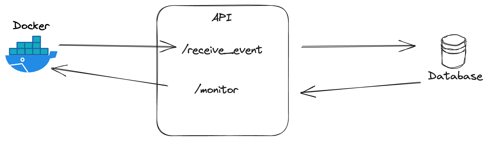

# Showcase of API solution using FastAPI and Duckdb

## Introduction
This is a showcase of a simple API solution using FastAPI and Duckdb. 
A containerized script will be sending requests with new event data to the API every second and the API will be storing the data in a Duckdb database. The API will also be able to return data upon request via the `/monitor` endpoint with aggregates of those events.

:warning: **Note that this is a showcase and not a production-ready solution. Both regarding quality and functionality.**

## How to run the solution
1. Clone the repository.
2. Make sure to load the docker image making requests to the API. The .tar.gz file should be loaded into the docker environment and be available as an image under `data_dao_de_task:latest`. 
3. [*OPTIONAL*] Provide `.env`-file with the following variables:
    - `MOTHERDUCK_PATH` - The path with motherduck token if you want to use the motherduck service. Example: `MOTHERDUCK_PATH=md:<MY_PROD_DATABASE>?motherduck_token=<MY_PROD_TOKEN>`
    - `DUCKDB_PATH` - name of the local Duckdb database. Example: `DUCKDB_PATH=apiService.duckdb`
    - `ENVIRONMENT` - The environment you are running the API in. `ENVIRONMENT=PROD` will make the API run in production mode. Otherwise, it will run in development mode and thus utilizing a local duckdb instance.

4. Run `docker-compose up -d --build` in the root directory of the repository.

These simple steps should get the API up and running.